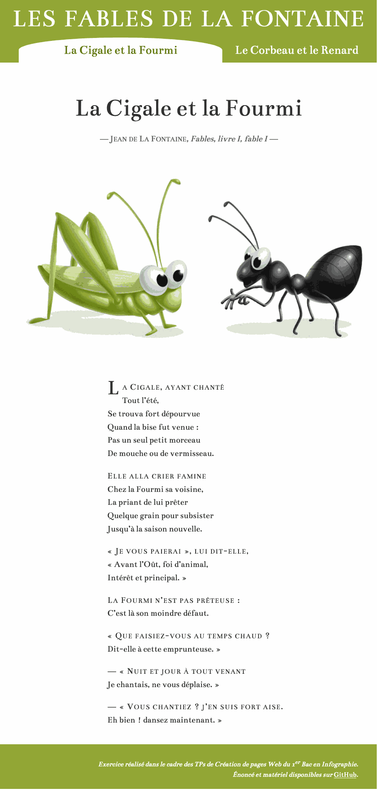
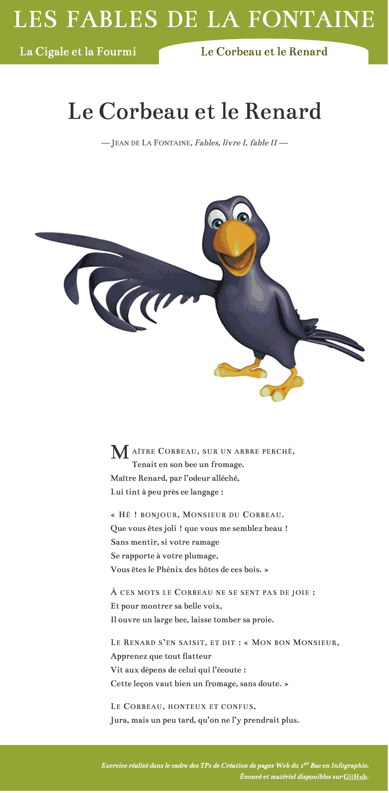
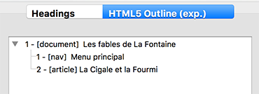
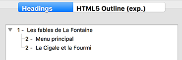

# "Fab Lafontaine"

> CSS exercise given at HEPL

* * *

**"Fab Lafontaine"** is an educational project, which will be used for `HTML`/`CSS` courses.

**Note:** the school where the course is given, the [HEPL](http://www.hepl.be) from Liège, Belgium, is a french-speaking school. From this point, the instruction will be in french. Sorry.

* * *

> Lors de vos cours de *web*, vous allez découvrir les langages HTML et CSS et les mettre en pratique pour apprendre à créer des pages web.  

* * *

## Fab Lafontaine

Vous trouverez dans le dossier __starter-assets__ deux fichiers textes, un nommé **cigale.txt**, et un nommé **corbeau.txt**. Ils contiennent chacun le texte de la Fable de Lafontaine correspondante.  

Votre mission est

1. de créer trois fichiers HTML qui permettent d’afficher le contenu de ces deux fichiers dans un navigateur web. Le fichier index permettra simplement de choisir entre les deux autres fichiers&nbsp;;
2. de valider votre code HTML dans un validateur&nbsp;; 
3. de lier la feuille de style qui donnera à ces deux pages le rendu suivant&nbsp;:
	* **La Cigale et la Fourmi** :

	* **Le Corbeau et le Renard** :

### 1. Création du fichier HTML

Pour vous aider, voici les étapes que vous pouvez suivre&nbsp;:

1. avant tout, et avant de commencer à taper du code dans un fichier, prenez le temps d’analyser le contenu fourni pour identifier les balises à utiliser. Vous pouvez vous aider du rendu ci-dessus pour identifier les grandes sections de la page. Le plan du document est très simple. Pour la première fable, il doit correspondre au résultat suivant&nbsp;:  

 

2. créer le fichier HTML et y placer les balises de départ qui fournissent un template de base complet, ce qui implique notamment :
	- de bien indiquer que le document est en français&nbsp;;
	- au niveau de l'en-tête du document, de bien définir les méta-informations grâce aux balises `meta`, `title`et `link` appropriées pour&nbsp;: 
	    * déclarer correctement l’encodage des caractères utilisé (pour ne pas avoir de problème d’affichage des caractères spéciaux et accentués dans le navigateur)&nbsp;;
	    * renseigner que vous êtes l’auteur du document&nbsp;;
	    * prévoir que, si on recherche votre page sur un moteur de recherche comme Google, les mots-clés suivants soient associés&nbsp;: Fables de La Fontaine, Jean de Lafontaine, fables, cigale et fourmi, cigale, fourmi (à adpater pour l’autre fable)&nbsp;;
	    * prévoir que, si on recherche votre page sur un moteur de recherche comme Google, le moteur de recherche affiche la description suivante pour votre page dans la page qui présente les résultats de recherche&nbsp;: «&nbsp;La Cigale et la Fourmi est la première fable du livre I de Jean de La Fontaine située dans le premier recueil des Fables de La Fontaine édité en 1668.&nbsp;»&nbsp;;
	    * prévoir que, si votre page est affichée dans un ancien navigateur IE qui ne reconnaît pas les nouvelles balises HTML5 (comme `nav`, `section, etc.), ces dernières puissent malgré tout être correctement affichées par le navigateur en question&nbsp;;
	    * faire en sorte que le titre du document qui s’affiche dans l’onglet du navigateur soit «&nbsp;La Cigale et la Fourmi – Fables de La Fontaine&nbsp;»&nbsp;;
	    * lier la feuille de style à votre page HTML&nbsp;;
	- au niveau du coprs du document, de découper la page en trois grandes sections :
	 	 * la bannière (balise `header`)&nbsp;;
	 	 * le contenu principal (balise `main`)&nbsp;;
	 	 * le pied ed page (balise `footer`)&nbsp;;
    
3. baliser le texte en utilisant les balises HTML correctes&nbsp;;

4. afficher l’image représentée dans le fichier `cigale-fourmi.jpg` avec, comme texte alternatif au cas où elle ne s’affiche pas, «&nbsp;La cigale et la fourmi en pleine discussion&nbsp;» (pour l’autre fable, il s'agira de l’image représentée dans le fichier `corbeau.png` avec, comme texte alternatif, «&nbsp;Le corbeau, bec ouvert, perdant son fromage&nbsp;»)&nbsp;;

5. faire en sorte que le lien «&nbsp;GitHub&nbsp;» du footer mène vers la page de l’organisation tecg-cpw dédiée à l’exercice html-fab-lafontaine sur GitHub à l’adresse https://github.com/tecg-cpw/html-fab-lafontaine.

### 2. Validation du code HTML

1. lancer un validateur&nbsp;:
    - soit **Total Validator** (le mieux) s’il est installé sur votre machine&nbsp;;
    - soit le [validateur HTML5 du W3C en ligne](https://validator.w3.org/#validate_by_upload) sinon&nbsp;;
2. interpréter les erreurs éventuelles fournies par le validateur&nbsp;;
3. corriger&nbsp;;
4. valider à nouveau jusqu'à ce qu’il n’y ait plus d'erreur.  

### 3. Aides 

#### 3.1. Balises à utiliser (dans le body)

- a
- article
- blockquote
- br
- cite (avec classe "author" ou "work" pour désigner respectivement l'auteur ou l'ouvrage)
- figure
- footer
- h1
- h2
- header
- img
- li (avec la classe "active" pour la page courante)
- main
- nav
- p (avec la classe "source" pour le paragraphe qui reprend les sources de la Fable)
- q
- ul

Consulter le livre de référence pour toutes informations utiles

#### 3.2. Conseils en matière de typographie

Veillez à bien respecter les règles de la typographie française (voir transparent projeté au cours théorique `entitesHTML_typo.pdf`) dans le centre de ressources de Myriam Dupont sur l’École virtuelle).

**Rappel : 7 choses à vérifier dans tout travail pour respecter les règles de la typographie française&nbsp;:**

 - Majuscules accentuées (`&Agrave;`, `&Acirc;` `&Eacute;`, `&Egrave;`, `&Ecirc;`, `&Ccedil;`), etc.
 - Espaces insécables avant les ponctuations hautes (`&nbsp;`)
 - Ligatures (`&oelig;`, `&aelig;`, etc.)
 - Guillemets typographiques du français (chevrons ouvrants et fermants `&laquo;` et `&raquo;`)
 - Apostrophe française (`&rsquo;`)
 - Points de suspension (`&hellip;`)
 - Tirets spéciaux pour les incises, les énumérations, … (`&ndash;`, `&madash;`, etc.)   

Bon Travail !