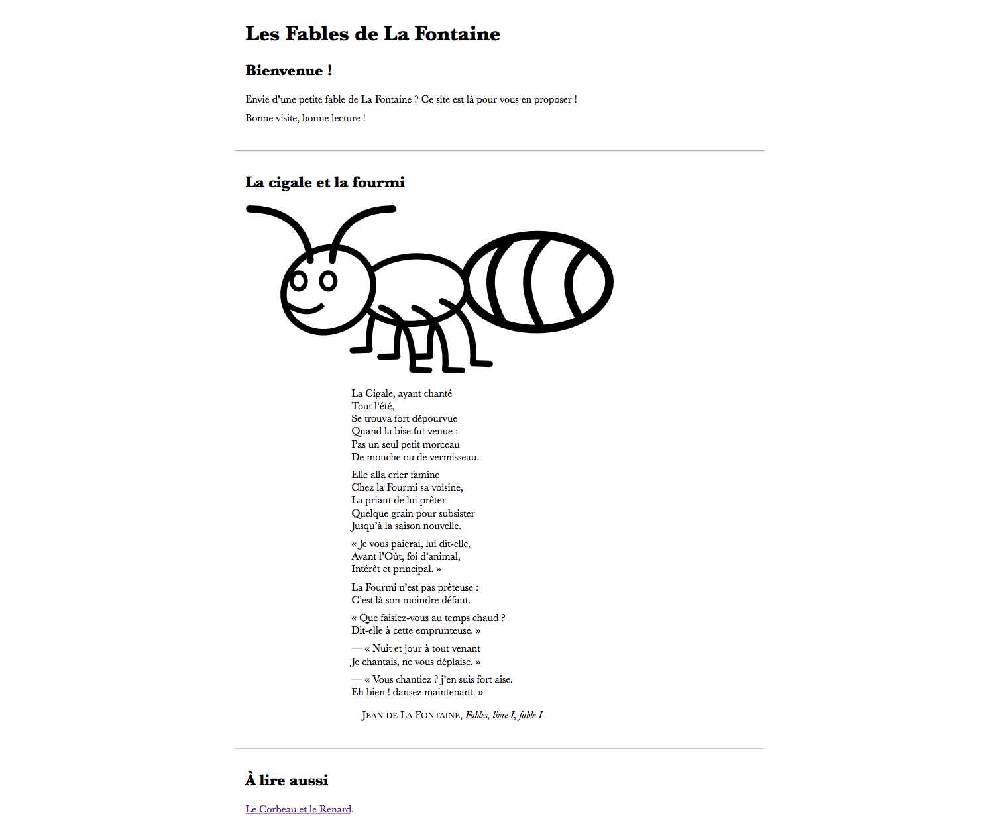
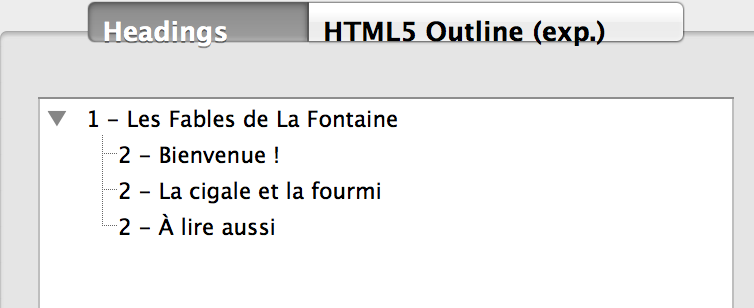

#Site «&nbsp;La Fontaine&nbsp;» (Pages Web liées avec images)

##Énoncé

Écrire 2 pages Web d'un site qui proposent la lecture de fables de La Fontaine et qui affichent chacune un en-tête introductif, une section avec une image d’illustration et la fable, un pied de page avec navigation vers une autre fable. 

Une fois votre travail terminé, vous pouvez lier la feuille de style fournie (screen.css) à votre document pour en améliorer le rendu.

##Balises à utiliser (dans le body)

- a
- blockquote
- br
- cite
- footer
- h1
- h2
- header
- hr
- img
- nav
- p
- q
- section

Consulter le livre de référence pour toutes informations utiles

##Résultats attendus

Voici la capture d’écran d’un exemple de réalisation :

Le plan de votre page doit correspondre au résultat suivant :

Les pages doivent bien entendu être valides.

Bon Travail !